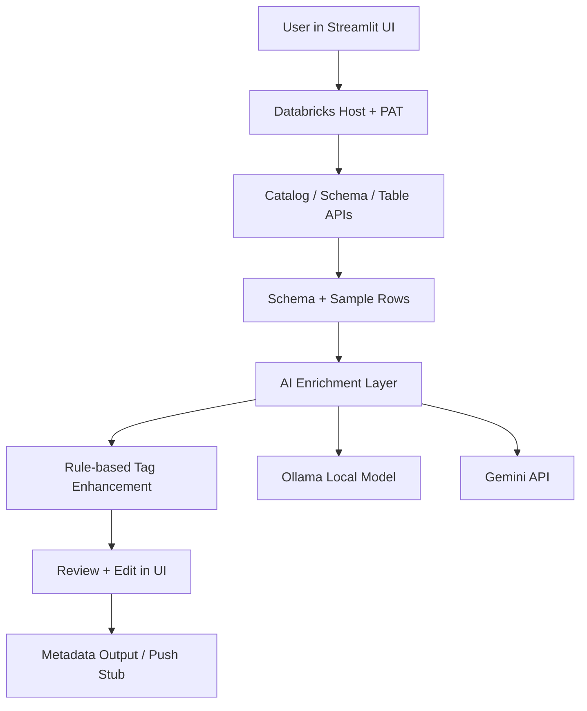

# CatalogSense

CatalogSense is an AI-assisted metadata enrichment application for Databricks Unity Catalog. It helps data teams automatically discover, classify, and describe table columns using a Streamlit interface, Databricks catalog APIs, and AI-based reasoning from local Ollama models or Gemini.

The project addresses a common challenge in modern data platforms: data assets exist, but their meaning, sensitivity, and business context are often incomplete or inconsistent. CatalogSense makes it easier to generate and review column metadata before publishing it to a governed catalog.

---

## Problem Statement

In most data platforms, especially lakehouse and warehouse environments, metadata often suffers from one or more of the following issues:

- Tables contain many columns without clear descriptions
- Sensitive fields such as email, phone, address, or financial information are not tagged consistently
- Governance teams need classification for privacy, compliance, and usage control
- The schema is available, but business meaning is missing
- Data stewards spend significant manual effort reviewing each column

This creates risk in areas such as:

- Data privacy and regulated-data handling
- Search and discoverability of enterprise datasets
- Trust in downstream analytics and reporting
- Faster onboarding for new data consumers

---

## Solution

CatalogSense solves this by combining:

1. Databricks Unity Catalog metadata APIs
2. Column schema inspection
3. Sample row analysis
4. Rule-based tag detection
5. AI-assisted enrichment using local or cloud models
6. A review workflow with user approval before publishing metadata

The application lets a user:

- Connect to Databricks using a PAT
- Select a catalog, schema, and table
- Inspect the table schema and fetch sample rows
- Generate AI-enriched metadata for each column
- Review generated descriptions, tags, and sensitivity labels
- Export or push the validated structured metadata for downstream use

---

## What the App Does

The current product workflow includes the following high-level actions:

### 1. Connection validation
The app checks access to Databricks endpoints for:

- SCIM user access
- Unity Catalog listing APIs
- SQL warehouse statements

This confirms connectivity and token validity before metadata generation.

### 2. Catalog browsing
It queries Databricks for:

- Catalogs
- Schemas
- Tables

This lets a user navigate the Unity Catalog structure directly from the UI.

### 3. Metadata retrieval
For a selected table, the system retrieves:

- Table metadata
- Column definitions and types
- Sample rows for context

### 4. AI-driven metadata generation
The app sends a prompt containing:

- Table name
- Column schema
- Example sample rows

Then it asks an AI model to produce a JSON output like this:

```json
[
  {
    "column_name": "customer_email",
    "short_description": "Customer email address used for account communication.",
    "tags": ["email", "pii", "personal"],
    "sensitivity": "High",
    "example_values": ["john@example.com"]
  }
]
```

### 5. Rule-based enhancement
After the model response, the app applies fallback rules to improve and standardize output:

- Person-name detection
- Email, phone, address, financial, date, and ID heuristics
- Normalization of tag synonyms
- Sensitivity mapping based on tags

### 6. Human review and push
Users can edit:

- Description
- Tags
- Sensitivity classification

The app currently exposes a push stub for Unity Catalog metadata updates, with a place to integrate the actual Databricks comment or governance API.

---

## Architecture

The project is a simple yet effective application architecture built around a Streamlit front end.



### Main architectural layers

- Frontend layer: Streamlit UI
- Service layer: Databricks API wrappers
- AI layer: Ollama or Gemini prompt generation
- Post-processing layer: regex and rule-based tagging
- Review layer: UI-driven validation and editing

---

## Tech Stack

- Python 3.x
- Streamlit
- Requests
- Databricks REST APIs
- Optional spaCy for NER fallback
- Ollama (local LLM support)
- Gemini API support
- JSON-based metadata generation

---

## Project Structure

```text
nltk_catlog/
├── autometa_app.py
├── .qodo/
│   └── CODE.PY
├── README.md
└── .qodo/workflows/
```

### Important file notes

- autometa_app.py: Main application logic and Streamlit UI
- .qodo/CODE.PY: Duplicate or working copy of the same app logic
- README.md: Product and project documentation

---

## How it Works

The typical user journey is:

1. Open the Streamlit app
2. Enter Databricks host and PAT
3. Test connectivity
4. Select a catalog, schema, and table
5. Fetch metadata and sample rows
6. Generate AI-based column classification
7. Review and adjust descriptions and tags
8. Push or export the final metadata

---

## Supported Data Sources

The current implementation is designed for:

- Databricks Unity Catalog
- Tables available through the Databricks SQL and catalog APIs
- Structured tabular schemas with sample rows

It is not a generic multi-database app yet. The code is tightly focused on Databricks-related metadata workflows.

---

## Setup Instructions

### Prerequisites

- Python installed
- Access to a Databricks workspace
- Valid Databricks PAT
- SQL warehouse ID (optional, but recommended for sample data)
- Local Ollama or Gemini API key

### Install dependencies

```bash
pip install streamlit requests
```

Optional:

```bash
pip install spacy
python -m spacy download en_core_web_sm
```

### Run locally

From the project folder:

```bash
streamlit run autometa_app.py
```

### Important note

The app should be launched with Streamlit rather than by running the file directly with Python. Direct execution causes Streamlit session-state issues.

---

## Environment Variables

The app reads these values if they are set in the environment:

- DATABRICKS_HOST
- DATABRICKS_TOKEN
- DATABRICKS_WAREHOUSE
- GEMINI_API_KEY

These values can also be entered manually in the Streamlit sidebar.

---

## AI Model Support

### Ollama
The app calls the local Ollama endpoint:

```text
http://localhost:11434/api/generate
```

It expects a model named `llama3` by default.

### Gemini
The app supports Gemini text generation with a bearer token and prompt-based request structure.

---

## Output Format

The app generates structured metadata records using a JSON array format. Each entry includes:

- column_name
- short_description
- tags
- sensitivity
- example_values

This format is designed for downstream governance, search indexing, and data catalog enrichment.

---

## Example Use Case

A financial team has a table named `sales_transactions` with 30 columns, but only a few have meaningful descriptions. CatalogSense can:

- browse the table schema
- inspect sample rows
- detect names, addresses, amounts, and dates
- assign tags and sensitivity levels
- help the team review and validate the metadata before publishing

This reduces catalog gaps and increases confidence in governance-related labeling.

---

## Current Gaps / Remaining Work

This project is a strong prototype, but there are still important areas to complete before broad production use.

### 1. Actual Unity Catalog write-back integration
The current `push_column_comment` function is a stub. It does not yet call the real Databricks metadata/write API.

Remaining work:

- Integrate Databricks catalog comment APIs
- Validate permissions and governance model
- Confirm write-back flow for schema or table metadata

### 2. Authentication and security hardening
The app currently accepts a PAT directly in the UI and can also prefill a Gemini key from environment variables.

Remaining work:

- Remove insecure defaults
- Add secret management guidance
- Enforce safer credential storage practices
- Add masked and validated secret flows

### 3. Better model validation and retries
The AI calls do not yet have a strong validation pipeline for malformed JSON or empty responses.

Remaining work:

- Validate AI output schema before use
- Retry logic with fallbacks
- Logging for failed generations

### 4. More robust sample-row handling
The app currently depends heavily on sample rows and schema names.

Remaining work:

- Improve support for nested or poorly formatted data
- Better handling of nulls, arrays, and mixed value types
- More resilient parsing for different row payloads

### 5. Production-quality UI and workflow controls
The user flow works, but it is still a functional prototype.

Remaining work:

- Better batch review for many columns
- Search/filter across columns
- Export to CSV or JSON
- Audit trail and change history

### 6. Business rule customization
Currently the app mostly uses rule-based heuristics.

Remaining work:

- Let users define custom tag vocabularies
- Add enterprise-specific sensitivity models
- Support organization-level classification policies

---

## Potential Future Enhancements

- Support for more data platforms beyond Databricks
- Bulk metadata generation for multiple tables
- Catalog scorecards and metadata completeness dashboards
- Policy-based automation for PII and sensitive data detection
- Integration with data quality, lineage, and governance workflows

---

## Summary

CatalogSense is a practical AI-assisted catalog metadata solution for Databricks Unity Catalog. It responds to a real enterprise problem: metadata is often missing, inconsistent, or incomplete, and the cost of fixing it manually is high.

The project combines Databricks APIs, AI generation, and human review to make metadata enrichment faster and more trustworthy. It is especially useful for data governance teams, platform engineers, and analytics organizations that need to improve catalog quality without spending excessive manual effort.

---

## License

This project has no explicit license file included yet. If you plan to share or distribute the project, add an appropriate open-source license such as MIT or Apache 2.0.

---

## Recommended Naming

The project identity for this repository is: CatalogSense AI

This branding reflects the product's purpose as an AI-assisted catalog metadata and governance solution for Databricks Unity Catalog.
